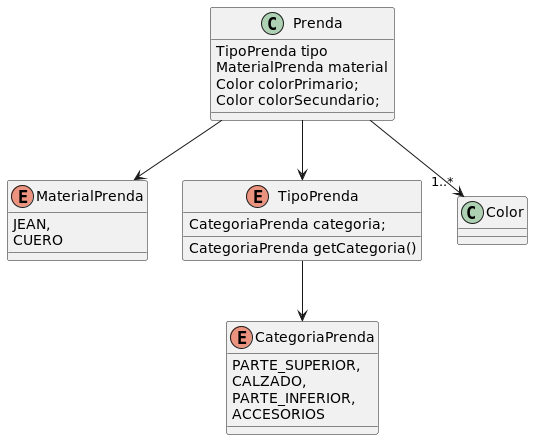

DDS - Que me pongo iteración I

## Diagrama de Clases

## Consideraciones

El conjunto de Materiales, Tipos y Categorias a modelar es finito y no se espera que varie demasiado en el tiempo,
esto nos permite abstraer estas entidades como Enum.

En el caso particular del TipoPrenda, al definirlas las asociamos a la su categoria correspondiente; el tipo y la 
están fuertemente acoplados, el tipo no puede cambiar de categoria en tiempo de ejecucion y viceversa. Desde el punto
de vista de la prenda, solo hace falta que conozca su tipo de prenda.

Decido no definir una clase color y optar por la Clase color de java.awt.Color, esta permite instanciar colores mediante
RGB o algunos colores predefinidos(BLACK, WHITE, BLUE...)

Al momento de crear una prenda, se valida que los atributos esenciales no sean nulos, fallando en el caso de que asi sea.
